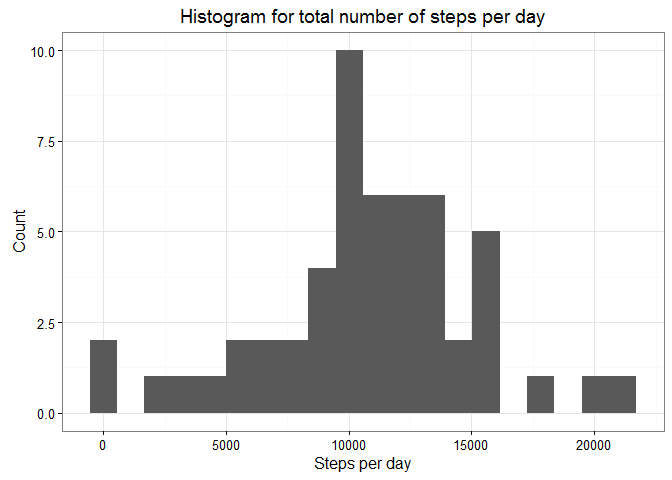
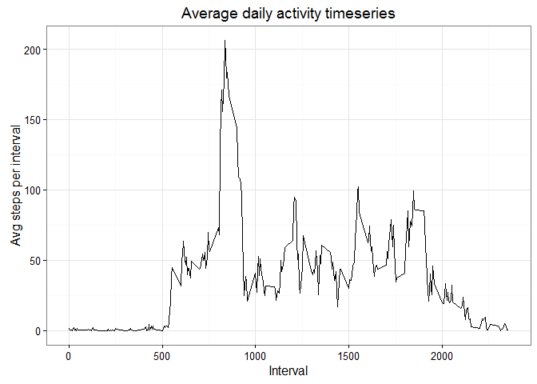
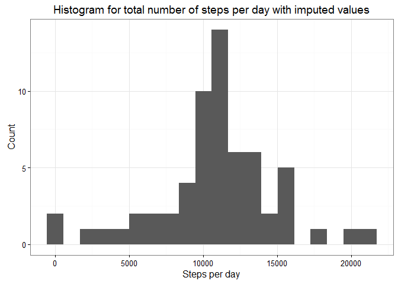
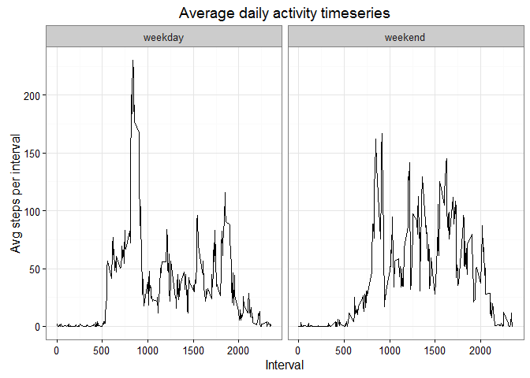

# Reproducible Research: Peer Assessment 1


## Loading and preprocessing the data

```r
#set aspects of the locale for the R process:
Sys.setlocale("LC_TIME", "English")
```

```
## [1] "English_United States.1252"
```

```r
#Call ggplot2 library for plotting:
require(ggplot2)

#Read data from file:
data.init <- read.csv('activity.csv', header = TRUE, sep = ',')

#Check data structure:
str(data.init)
```

```
## 'data.frame':	17568 obs. of  3 variables:
##  $ steps   : int  NA NA NA NA NA NA NA NA NA NA ...
##  $ date    : Factor w/ 61 levels "2012-10-01","2012-10-02",..: 1 1 1 1 1 1 1 1 1 1 ...
##  $ interval: int  0 5 10 15 20 25 30 35 40 45 ...
```

```r
#Print head of data:
head(data.init[complete.cases(data.init$steps),])
```

```
##     steps       date interval
## 289     0 2012-10-02        0
## 290     0 2012-10-02        5
## 291     0 2012-10-02       10
## 292     0 2012-10-02       15
## 293     0 2012-10-02       20
## 294     0 2012-10-02       25
```

```r
#Convert data to numeric type:
data.init[, c(1,3)] <- sapply(data.init[, c(1,3)], as.numeric)

#Convert date to date format:
data.init$newdate <- strptime(data.init$date, '%Y-%m-%d')
```

## What is mean total number of steps taken per day?
*The total number of steps taken per day aggregated with the next table:*

```r
#Aggregate data as sum of steps per day:
data_by_day <- aggregate(steps~date, data = data.init, FUN = sum)
#Print head of data:
head(data_by_day)
```

```
##         date steps
## 1 2012-10-02   126
## 2 2012-10-03 11352
## 3 2012-10-04 12116
## 4 2012-10-05 13294
## 5 2012-10-06 15420
## 6 2012-10-07 11015
```

*Histogram for the  total number of steps taken per day produced below:*

```r
#Produce histogram:
ggplot(data = data_by_day, aes(x = steps)) + geom_histogram(bins = 20) + xlab('Steps per day')+
ylab('Count') +
ggtitle('Histogram for total number of steps per day') + theme_bw()
```

<!-- -->

*The mean of the total number of steps taken per day:*

```r
#Calculate mean:
mean_steps_per_day <- mean(data_by_day$steps)
mean_steps_per_day
```

```
## [1] 10766.19
```
*The  median of the total number of steps taken per day:*

```r
#Calculate median:
median_steps_per_day <- median(data_by_day$steps)
median_steps_per_day
```

```
## [1] 10765
```


## What is the average daily activity pattern?
*The average number of steps taken per interval aggregated with the next table:*

```r
#Aggregate data as avg of steps by interval:
data_by_interval <- aggregate(steps~interval, data = data.init, FUN = mean)
#Print head of data:
head(data_by_interval)
```

```
##   interval     steps
## 1        0 1.7169811
## 2        5 0.3396226
## 3       10 0.1320755
## 4       15 0.1509434
## 5       20 0.0754717
## 6       25 2.0943396
```

*Timeseries plot for the  average number of steps taken per interval produced below:*

```r
#Produce timeseries plot:
ggplot(data = data_by_interval, aes(x = interval, y = steps))+
geom_line() + xlab('Interval')+
ylab('Avg steps per interval') +
ggtitle('Average daily activity timeseries') + theme_bw()
```

<!-- -->

*5-minute interval, which on average across all the days in the dataset, contains the maximum number of steps is the next:*

```r
#Find interval with the max number of steps:
interval_max_activity <- data_by_interval[which.max(data_by_interval$steps),1]
```

## Imputing missing values
*The total number of missing values in the dataset (i.e. the total number of rows with NAs):*

```r
#Find dimension of dataset including inclomplete rows only:
missing_rows_number <- dim(data.init[which(is.na(data.init$steps)),])[1]
missing_rows_number
```

```
## [1] 2304
```

*The strategy for filling in all of the missing values in the dataset is 5the next. We  use the mean for that 5-minute interval instead of missing values:*

```r
#Create copy of dataset:
data.imputed <- data.init
#Merge data with avg data by interval:
data.imputed<- merge(data.imputed, data_by_interval, by = 'interval')
#Use new colnames for merged dataset:
colnames(data.imputed)[c(2,5)] <- c('steps', 'avg_steps_by_interval')
#Fill missing number of steps with avg by interval:
for (rows in 1:dim(data.imputed)[1]){
  if(is.na(data.imputed$steps[rows])){
    data.imputed$steps[rows] <- data.imputed$avg_steps_by_interval[rows]
  }
}
```
*Let's summarize new dataset by daily total:*

```r
#Aggregate sum of steps per day:
data_by_day_new <- aggregate(steps~date, data = data.imputed, FUN = sum)
#View head of dataset:
head(data_by_day_new)
```

```
##         date    steps
## 1 2012-10-01 10766.19
## 2 2012-10-02   126.00
## 3 2012-10-03 11352.00
## 4 2012-10-04 12116.00
## 5 2012-10-05 13294.00
## 6 2012-10-06 15420.00
```
*Histogram for the total number of steps by day across imputed dataset is the next:*

```r
#Produce histogram:
ggplot(data = data_by_day_new, aes(x = steps)) + geom_histogram(bins = 20) + xlab('Steps per day')+
ylab('Count') +
ggtitle('Histogram for total number of steps per day with imputed values') + theme_bw()
```

<!-- -->

*The mean of the total number of steps taken per day across imputed dataset is the next:*

```r
mean_steps_per_day_new <- mean(data_by_day_new$steps)
mean_steps_per_day_new
```

```
## [1] 10766.19
```

*The median of the total number of steps taken per day across imputed dataset is the next:*

```r
median_steps_per_day_new <- median(data_by_day_new$steps)
median_steps_per_day_new
```

```
## [1] 10766.19
```
*As we can see mean and median value have been changed slightly. It means we have chosen accurate stratege to fill missing values. As we have changed NA's with mean values, median is equal to mean now.*

## Are there differences in activity patterns between weekdays and weekends?
*Lets produce column identifying the day as weekday/weekend:*

```r
#Convert date to day of week format:
data.imputed$daysofweek <- format(data.imputed$newdate, '%a')
#Append data with new column:
data.imputed$weekday <- 'weekday'
#Fill new column as weekday/weekend:
for (rows in 1:dim(data.imputed)[1]){
  if(data.imputed$daysofweek[rows]=='Sat' | data.imputed$daysofweek[rows]=='Sun'){
    data.imputed$weekday[rows] <- 'weekend'
  }
}
#Convert weekday column to factor type:
data.imputed$weekday <- factor(data.imputed$weekday)
#View data head:
head(data.imputed)
```

```
##   interval    steps       date    newdate avg_steps_by_interval daysofweek
## 1        0 1.716981 2012-10-01 2012-10-01              1.716981        Mon
## 2        0 0.000000 2012-11-23 2012-11-23              1.716981        Fri
## 3        0 0.000000 2012-10-28 2012-10-28              1.716981        Sun
## 4        0 0.000000 2012-11-06 2012-11-06              1.716981        Tue
## 5        0 0.000000 2012-11-24 2012-11-24              1.716981        Sat
## 6        0 0.000000 2012-11-15 2012-11-15              1.716981        Thu
##   weekday
## 1 weekday
## 2 weekday
## 3 weekend
## 4 weekday
## 5 weekend
## 6 weekday
```

*Data are summarized with the next pannel plot:*

```r
#Aggregate data by interval and weekday type as mean of steps number:
data_by_interval_new <- aggregate(steps~interval+weekday, data = data.imputed, FUN = mean)
#Produce panel plot:
ggplot(data = data_by_interval_new, aes(x = interval, y = steps))+
geom_line() + xlab('Interval')+
ylab('Avg steps per interval') +
ggtitle('Average daily activity timeseries') + theme_bw() + facet_grid( ~ weekday)
```

<!-- -->

