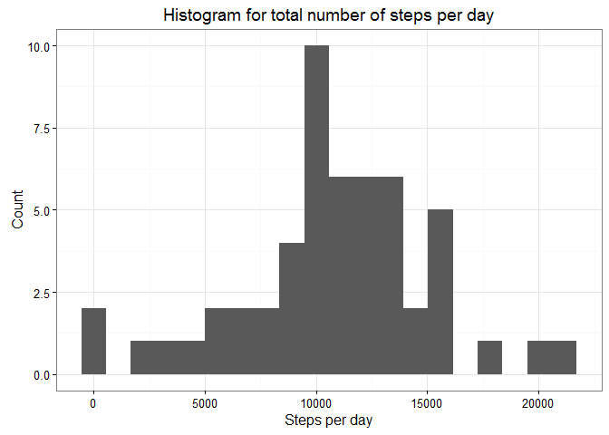
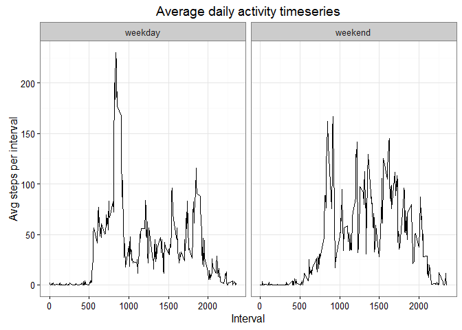

# Reproducible Research: Peer Assessment 1


## Loading and preprocessing the data

```r
Sys.setlocale("LC_TIME", "English")
```

```
## [1] "English_United States.1252"
```

```r
require(ggplot2)

data.init <- read.csv('activity.csv', header = TRUE, sep = ',')

str(data.init)
```

```
## 'data.frame':	17568 obs. of  3 variables:
##  $ steps   : int  NA NA NA NA NA NA NA NA NA NA ...
##  $ date    : Factor w/ 61 levels "2012-10-01","2012-10-02",..: 1 1 1 1 1 1 1 1 1 1 ...
##  $ interval: int  0 5 10 15 20 25 30 35 40 45 ...
```

```r
head(data.init)
```

```
##   steps       date interval
## 1    NA 2012-10-01        0
## 2    NA 2012-10-01        5
## 3    NA 2012-10-01       10
## 4    NA 2012-10-01       15
## 5    NA 2012-10-01       20
## 6    NA 2012-10-01       25
```

```r
data.init[, c(1,3)] <- sapply(data.init[, c(1,3)], as.numeric)

data.init$newdate <- strptime(data.init$date, '%Y-%m-%d')
```

## What is mean total number of steps taken per day?

```r
data_by_day <- aggregate(steps~date, data = data.init, FUN = sum)

ggplot(data = data_by_day, aes(x = steps)) + geom_histogram(bins = 20) + xlab('Steps per day')+
ylab('Count') +
ggtitle('Histogram for total number of steps per day') + theme_bw()
```

<!-- -->

```r
mean_steps_per_day <- mean(data_by_day$steps)
mean_steps_per_day
```

```
## [1] 10766.19
```

```r
median_steps_per_day <- median(data_by_day$steps)
median_steps_per_day
```

```
## [1] 10765
```

## What is the average daily activity pattern?

```r
data_by_interval <- aggregate(steps~interval, data = data.init, FUN = mean)

ggplot(data = data_by_interval, aes(x = interval, y = steps))+
geom_line() + xlab('Interval')+
ylab('Avg steps per interval') +
ggtitle('Average daily activity timeseries') + theme_bw()
```

<!-- -->

```r
interval_max_activity <- data_by_interval[which.max(data_by_interval$steps),1]
```

## Imputing missing values

```r
missing_rows_number <- dim(data.init[which(is.na(data.init$steps)),])[1]
data.imputed <- data.init
data.imputed<- merge(data.imputed, data_by_interval, by = 'interval')
colnames(data.imputed)[c(2,5)] <- c('steps', 'avg_steps_by_interval')
for (rows in 1:dim(data.imputed)[1]){
  if(is.na(data.imputed$steps[rows])){
    data.imputed$steps[rows] <- data.imputed$avg_steps_by_interval[rows]
  }
}
data_by_day_new <- aggregate(steps~date, data = data.imputed, FUN = sum)

ggplot(data = data_by_day_new, aes(x = steps)) + geom_histogram(bins = 20) + xlab('Steps per day')+
ylab('Count') +
ggtitle('Histogram for total number of steps per day with imputed values') + theme_bw()
```

<!-- -->

```r
mean_steps_per_day_new <- mean(data_by_day_new$steps)
mean_steps_per_day_new
```

```
## [1] 10766.19
```

```r
median_steps_per_day_new <- median(data_by_day_new$steps)
median_steps_per_day_new
```

```
## [1] 10766.19
```

## Are there differences in activity patterns between weekdays and weekends?

```r
data.imputed$daysofweek <- format(data.imputed$newdate, '%a')
data.imputed$weekday <- 'weekday'
for (rows in 1:dim(data.imputed)[1]){
  if(data.imputed$daysofweek[rows]=='Sat' | data.imputed$daysofweek[rows]=='Sun'){
    data.imputed$weekday[rows] <- 'weekend'
  }
}
data.imputed$weekday <- factor(data.imputed$weekday)

data_by_interval_new <- aggregate(steps~interval+weekday, data = data.imputed, FUN = mean)

ggplot(data = data_by_interval_new, aes(x = interval, y = steps))+
geom_line() + xlab('Interval')+
ylab('Avg steps per interval') +
ggtitle('Average daily activity timeseries') + theme_bw() + facet_grid( ~ weekday)
```

<!-- -->

